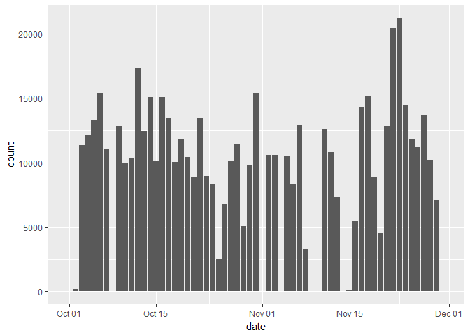
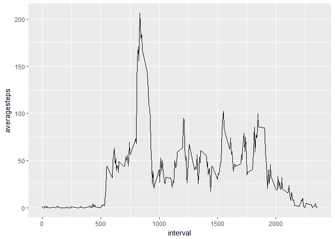
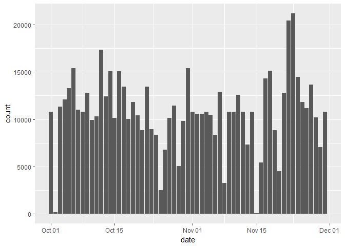
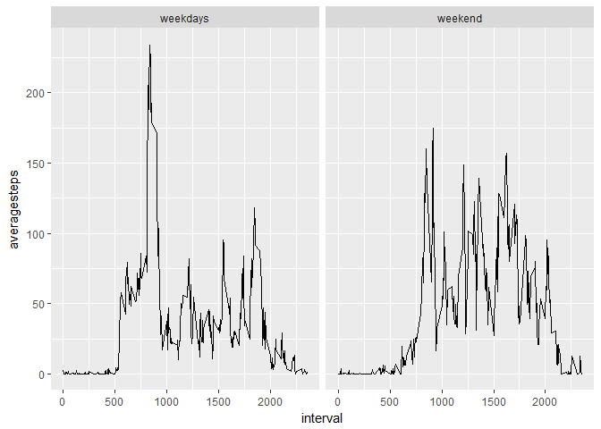

# Reproducible Research: Peer Assessment 1

## Load libraries

```r
library("ggplot2")
library("Hmisc")
```

```
## Loading required package: lattice
```

```
## Loading required package: survival
```

```
## Loading required package: Formula
```

```
## 
## Attaching package: 'Hmisc'
```

```
## The following objects are masked from 'package:base':
## 
##     format.pval, round.POSIXt, trunc.POSIXt, units
```

```r
library("dplyr")
```

```
## 
## Attaching package: 'dplyr'
```

```
## The following objects are masked from 'package:Hmisc':
## 
##     combine, src, summarize
```

```
## The following objects are masked from 'package:stats':
## 
##     filter, lag
```

```
## The following objects are masked from 'package:base':
## 
##     intersect, setdiff, setequal, union
```

## Loading and preprocessing the data

```r
t = read.csv(unz("activity.zip", "activity.csv")) %>% 
    as_tibble %>%
    mutate(date = as.Date(date))
```

## What is mean total number of steps taken per day?
1. Total number of steps taken per day

```r
a1 = t %>%
     group_by(date) %>% 
     summarize(count = sum(steps, na.rm = TRUE))
```

2. Histogram of the total number of steps taken each day

```r
ggplot(a1, aes(x = date, y = count)) + geom_bar(stat = "identity") 
```

<!-- -->

3. Mean:

```r
mean(a1$count, na.rm = TRUE)
```

```
## [1] 9354.23
```

4. Median:

```r
median(a1$count, na.rm = TRUE)
```

```
## [1] 10395
```

## What is the average daily activity pattern?
1. Timeseries plot

```r
a2 = t %>%
     group_by(interval) %>%
     summarize(averagesteps = mean(steps, na.rm = TRUE))
ggplot(a2, aes(interval, averagesteps)) + geom_line()
```

<!-- -->

2. Interval containing the maximum number of steps:

```r
a2[which.max(a2$averagesteps), ]$interval
```

```
## [1] 835
```

## Imputing missing values
1. Calculate and report the total number of missing values in the dataset

```r
length(which(is.na(t$steps)))
```

```
## [1] 2304
```
 2. A strategy for filling in all of the missing values in the dataset.
3. Create a new dataset that is equal to the original dataset but with the missing data filled in.

```r
t2 = t
t2$steps = impute(t$steps, fun = mean)
```

4. Make a histogram of the total number of steps taken each day,

```r
a3 = t2 %>%
     group_by(date) %>% 
     summarize(count = sum(steps, na.rm = TRUE))
ggplot(a3, aes(x = date, y = count)) + geom_bar(stat = "identity") 
```

<!-- -->

5. New mean:

```r
mean(a3$count, na.rm = TRUE)
```

```
## [1] 10766.19
```

6. New median:

```r
median(a3$count, na.rm = TRUE)
```

```
## [1] 10766.19
```

6. Do these values differ from the estimates from the first part of the assignment?
Yes

7. What is the impact of imputing missing data on the estimates of the total daily number of steps?
It increases the total

## Are there differences in activity patterns between weekdays and weekends?
1. Create a new factor variable in the dataset with two levels – “weekday” and “weekend”

```r
t2 = t %>% mutate(dateType = if_else(as.POSIXlt(date)$wday %in% c(1:5), "weekdays", "weekend"))
```

2. Make a panel plot containing a time series plot (i.e. type = "l") of the 5-minute interval (x-axis) and the average number of steps taken, averaged across all weekday days or weekend days (y-axis).

```r
a4 = t2 %>%
     group_by(interval, dateType) %>%
     summarize(averagesteps = mean(steps, na.rm = TRUE))
ggplot(a4, aes(interval, averagesteps)) + facet_grid(.~dateType) + geom_line()
```

<!-- -->
